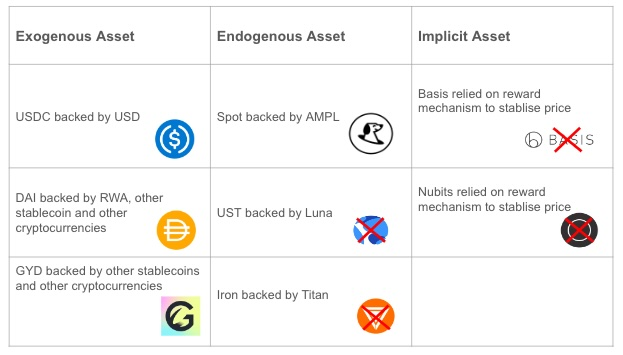

# Asset Backing Risk 
This risk arises when the market value of assets backing a stablecoin drops below the pegged value (for stablecoins referenced to an asset/index) or becomes too volatile for the stablecoin to maintain its stability (for those not referenced to any asset/index). Such situations increase the likelihood of the stablecoin depegging or becoming overly volatile, potentially leading to the complete failure of the protocol.

These assets, also referred to as collateral, are categorised as **exogenous assets**, **endogenous assets**, and **implicit assets** based on how their value is derived.

- **Exogenous assets**. These are assets that exist independently of the stablecoin and have broader use cases beyond backing the stablecoin’s value. The amount of these assets used to back a stablecoin is typically small relative to their use in other markets. Examples include the US dollar for USDC and USDT, USDC for DAI, and ETH for LUSD.

- **Endogenous asset**. These assets are created specifically to back the stablecoin and have limited use outside of the project. Their value is directly tied to the demand for the stablecoin they support—when demand for the stablecoin rises, so does the value of the endogenous asset. However, during a crisis of confidence, selling pressure on the stablecoin can cause both the stablecoin and its endogenous asset to enter a "death spiral," with both values plummeting. Notable examples include LUNA/UST and TITAN/IRON.

- **Implicit asset**. Some stablecoins do not have explicit assets as collateral, instead relying on market mechanisms—such as speculators and incentive systems—to dynamically adjust supply and stabilise prices. While similar to endogenous assets, implicit assets are not tokenized and thus do not have an observable market price. An example of this model is Basis, a project that shut down in 2018.

It’s common for stablecoin projects to use a mix of exogenous and endogenous assets as collateral.

The table below provides examples of the asset types chosen by various stablecoins to back their value, including projects like Terra’s UST, Iron, Basis, and NuBit, all of which have since failed.

## Risk Metrics
The following is a comprehensive list of risk metrics recommended for assessing stablecoin asset backing risks.

**1. Asset Type**: how collateral asset values are derived - exogenous, endogenous or implicit

**2. Asset Backing Ratio**: This ratio compares the value of assets backing the stablecoin to the value of stablecoins in circulation, ensuring the stablecoin is at least 100% backed. This metric applies only to assets with observable market prices.

**3. Asset Breakdown**: A detailed list showing the assets backing the stablecoin, along with their respective percentage breakdown. This is especially important for non-custodial stablecoins, where asset composition is transparent and critical to risk assessment.

**4. Validation of Real-World Assets (RWA)**: Evidence confirming the ownership of off-chain assets. For example, this could include the name of the RWA custodian and the tickers of tradable financial instruments (e.g., bonds, loans, securities, commodities).

**5. Asset Location**: The physical and legal jurisdiction of the assets and their custodians, where applicable. This includes naming the financial institutions responsible for holding off-chain assets.

**6. Information Quality**: The quality of asset-related information is measured by two factors: (1) the transparency of the information and (2) the frequency of verification. Most non-custodial stablecoins provide top-quality information as their reserves are held on-chain, offering full transparency.

For custodial stablecoins, users must rely on centralized entities for asset verification. The SRAF framework suggests to assess imformation quality by answering the following questions:

- Who conducted the verification? A reputable, independent accounting firm offers more reliable information than an unknown entity.
- Audit vs. Attestation: Audits involve a formal examination of the accounts holding the stablecoin reserve, while attestations simply review reserve information provided by the stablecoin project. Audits offer a higher level of assurance.
- Frequency of Verification: More frequent verification is generally better, but the quality of the verification process is key—a less frequent audit is often more reliable than frequent attestations.

## Asset Backing Risk Assessment Example
The table below provides an example of high-level asset backing risk analysis for USDC, USDT, DAI, and LUSD as of Oct 2023.

| **Metric**           | **USDC** | **USDT** | **DAI** | **LUSD** |  
|----------------------|---------|---------|---------|---------|  
| **Asset Type**       | Exogenous | Exogenous | Exogenous | Exogenous |  
| **Asset Back Ratio** | >100% | >100% | >100% | >100% |  
| **Asset Breakdown**  | 85% short US treasuries, 15% cash at US banks | 58% US T-Bills, 11% MMFs, 8% bank deposits, 5% cash equivalents, mix of corporate bonds, funds, metals, secured loans, digital tokens | 44% USDC, 10% USDP, 7% GUSD, remainder overcollateralized by other cryptocurrencies (mostly ETH) | 100% ETH |  
| **Validation of RWA** | Annual audit, Monthly attestation | Monthly attestation | Tokenized RWA | Not required |  
| **Asset Location**   | US Banks | Unknown | Onchain | Onchain |  
| **Information Quality** | Medium | Very Low | High | Transparent |  

